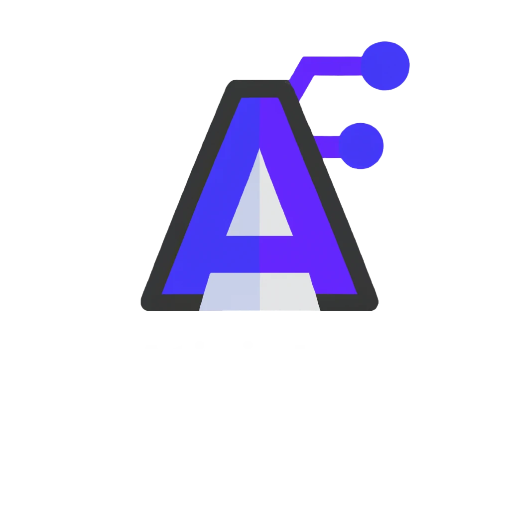

<!-- Improved compatibility of back to top link: See: https://github.com/othneildrew/Best-README-Template/pull/73 -->

<!--
*** Thanks for checking out the Best-README-Template. If you have a suggestion
*** that would make this better, please fork the repo and create a pull request
*** or simply open an issue with the tag "enhancement".
*** Don't forget to give the project a star!
*** Thanks again! Now go create something AMAZING! :D
-->

<!-- PROJECT SHIELDS -->
<!--
*** I'm using markdown "reference style" links for readability.
*** Reference links are enclosed in brackets [ ] instead of parentheses ( ).
*** See the bottom of this document for the declaration of the reference variables
*** for contributors-url, forks-url, etc. This is an optional, concise syntax you may use.
*** https://www.markdownguide.org/basic-syntax/#reference-style-links
-->

[![MIT License][license-shield]][license-url]

<!-- PROJECT LOGO -->
 

  

  <h3 align="center">Brand Generator</h3>

  

    A simple web-app that showcases the capabilities of the <a href="https://openai.com/api/">GPT-3 Api</a> 
     
    <a href="https://brand-generator.netlify.app/">View Demo</a>
    ·
    <a href="https://github.com/jmelo-435/react_OpenAI_brand_generator/issues">Report Bug</a>
  

<!-- TABLE OF CONTENTS -->

  
Table of Contents

  <ol>
    <li>
      <a href="#about-the-project">About The Project</a>
      <ul>
        <li><a href="#built-with">Built With</a></li>
      </ul>
    </li>
    <li><a href="#contact">Contact</a></li>
    <li><a href="#acknowledgments">Acknowledgments</a></li>
  </ol>

<!-- ABOUT THE PROJECT -->
## About The Project

[![Product Name Screen Shot][product-screenshot]](https://brand-generator.netlify.app/)
This app consists in a Website that sugests a name , a description , a slogan and a color scheme to a business based on data provided by the user.
The main goal of the project is to make evident how complex tasks can be easily acomplished using the power of AI text-oriented API's. 

### Built With

  
  
  
  
  

(<a href="#readme-top">back to top</a>)

<!-- CONTACT -->
## Contact

Jeferson Melo - jefersonmedeiros000@gmail.com

Project Link: [Brand Generator](https://brand-generator.netlify.app/)

(<a href="#readme-top">back to top</a>)

<!-- ACKNOWLEDGMENTS -->
## Acknowledgments

Use this space to list resources you find helpful and would like to give credit to. I've included a few of my favorites to kick things off!

* [Choose an Open Source License](https://choosealicense.com)
* [Img Shields](https://shields.io)
* [React Icons](https://react-icons.github.io/react-icons/search)
* [Material UI](https://mui.com/material-ui/material-icons/)
* [Django Rest Framework](https://www.django-rest-framework.org/)

(<a href="#readme-top">back to top</a>)

<!-- MARKDOWN LINKS & IMAGES -->
<!-- https://www.markdownguide.org/basic-syntax/#reference-style-links -->
[license-shield]: https://img.shields.io/github/license/othneildrew/Best-README-Template.svg?style=for-the-badge
[license-url]: https://github.com/othneildrew/Best-README-Template/blob/master/LICENSE.txt
[product-screenshot]: images/brand_generator.png

